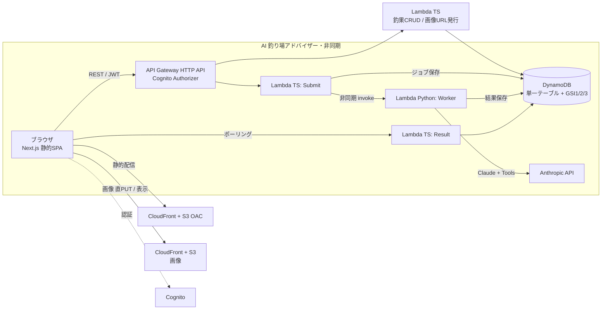

# Anglog（アングログ）🎣

釣果を記録・共有できる Web アプリ。魚種・サイズ・釣り方・場所・**当時の天気**まで記録して公開共有でき、**Claude を使った AI 釣り場アドバイザー**が「自分の釣果DB × 天気予報 × Web検索」を根拠に、出典・証拠付きで釣り場を提案します。

🔗 **Live Demo:** https://d194vw46i4j3i5.cloudfront.net

> フルサーバレス（AWS）／ IaC（CDK）／ 静的ホスティングで**月額ほぼ無料枠内**で運用。個人開発でエージェント型 AI を本番実装した実績を示すためのプロジェクトです。

---

## 主な機能

- 📍 **釣果の記録・公開共有（CRUD）** — 地図でピン留め、写真添付、記録時の天気を自動スナップショット
- 🗺️ **地図フィード**（MapLibre GL）で公開釣果をピン表示・クリックで詳細へ
- 🌤️ **当時の天気を自動取得**（Open-Meteo。緯度経度＋日時から気温・風・気圧・天気）
- 📷 **写真アップロード** — S3 署名付きPUT URL で直アップロード、CloudFront(OAC) 配信、アップロード前にクライアント側で縮小
- 🤖 **AI 釣り場アドバイザー** — 自然文の相談にエージェントがツールを呼び、**根拠（アプリ内釣果カード＋外部出典リンク）付き**で回答（下記詳細）
- 🎨 shadcn/ui ＋ teal 基調のデザイン、**ダークモード対応**、レスポンシブ
- 🔐 Cognito 認証

---

## 技術スタック

| レイヤー | 技術 |
|---|---|
| フロントエンド | Next.js 16（App Router・静的書き出し）/ TypeScript / Tailwind CSS v4 / shadcn/ui / MapLibre GL |
| バックエンド | AWS Lambda（TypeScript）/ API Gateway (HTTP API) / DynamoDB（シングルテーブル＋GSI×3） |
| AI | **Python Lambda** + Anthropic **Claude（claude-opus-4-8）** / Tool Runner（function calling）/ Web検索ツール |
| 認証 | Amazon Cognito（Amplify v6） |
| ストレージ/配信 | S3（非公開）+ CloudFront（OAC） |
| IaC | AWS CDK（TypeScript）/ Docker（Python Lambda バンドル） |
| モノレポ | pnpm workspace（apps/web・packages/infra・packages/shared） |

---

## アーキテクチャ



---

## 🤖 AI 釣り場アドバイザー（本プロジェクトの核）

「週末に息子と行ける、駐車場あり・アジが釣れる近場ある？」のような自然文の相談に、Claude エージェントが**ツールを呼びながら根拠付きで**回答します。

**エージェント設計（Claude + Tool Runner）**
- `search_catches` … アプリの公開釣果（DynamoDB GSI2）を検索＝**一次情報**
- `get_forecast` … 予定日の天気予報（Open-Meteo）
- `web_search` … Claude のサーバー側 Web 検索ツールで**外部の最新公開情報**も取得（出典付き）
- Claude が状況に応じてツールを選び、**アプリ内データ・予報・外部情報を統合**して提案

**グラウンディング（ハルシネーション対策）**
- 回答は**出典URLを別タブで開くリンク**として表示
- 提案の根拠にしたアプリ内釣果を**実カードで併記**（回答末尾に構造化した catchId を出力→フロントで CatchCard 表示）

**非同期アーキテクチャ（なぜ）**
エージェント＋Web検索は数十秒〜分かかり、同期 API（〜30秒）ではタイムアウトする。そこで **Submit（受付→jobId 即返す）→ Worker（裏でエージェント実行→DBに結果保存）→ Result（ポーリングで取得）** に分離。フロントは jobId を受け取り 2 秒間隔でポーリングして回答を表示。

---

## インフラ（AWS CDK）

すべて `packages/infra` の CDK で定義：
- DynamoDB（単一テーブル・PK/SK＋GSI×3、オンデマンド）
- Lambda 群（TS: 釣果CRUD・画像URL発行・Advisor Submit/Result / Python: Advisor Worker）
- API Gateway（HTTP API・Cognito JWT オーソライザ・CORS）
- Cognito User Pool
- S3 ×2（画像／web 静的ホスティング）＋ CloudFront ×2（OAC・URL書換 Function）
- Secrets Manager（Anthropic API キー）
- 月次バジェットアラーム

---

## ディレクトリ構成

```
.
├── apps/web/               # Next.js フロントエンド
├── packages/
│   ├── infra/              # AWS CDK
│   │   ├── lib/anglog-stack.ts
│   │   ├── lambda/         # TypeScript Lambda（釣果CRUD・Advisor Submit/Result）
│   │   └── lambda-py/      # Python Lambda（Advisor Worker＝AI本体）
│   └── shared/             # 共有型（Catch, GeoPoint 等）
└── README.md
```

---

## ローカル開発

```bash
pnpm install
# フロント（apps/web/.env.local に NEXT_PUBLIC_* を設定）
pnpm --filter @anglog/web dev
```

## デプロイ

```bash
# インフラ（Lambda / API / DynamoDB / Cognito / CloudFront 等）
pnpm --filter @anglog/infra run deploy   # ※Python Lambda のため Docker 起動が必要

# フロント（静的書き出し → S3 へアップロード＋CloudFront キャッシュ無効化）
pnpm --filter @anglog/web build
pnpm --filter @anglog/infra run deploy
```

> `NEXT_PUBLIC_*` はビルド時に焼き込むため、値を変えたら web の再ビルド＋再デプロイが必要。

---

## コスト

CloudFront／Lambda／S3 の無料枠と DynamoDB オンデマンドにより、個人利用の低トラフィックでは**月額ほぼ無料枠内**。AI（Claude）利用ぶんのみ従量で、Secrets Manager 管理・月次バジェットアラームでコストを監視。
